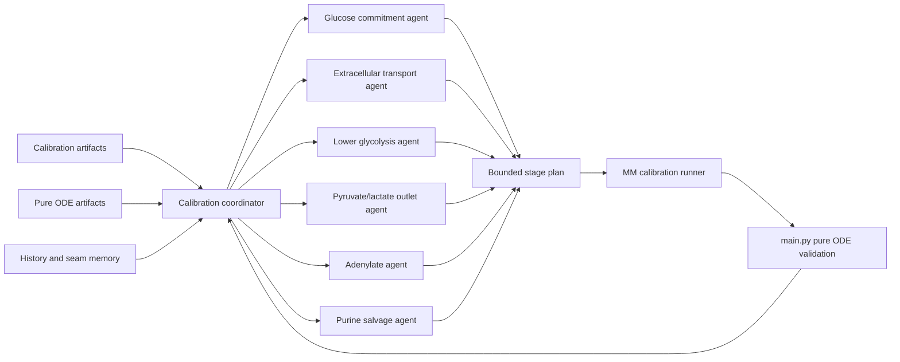

# Calibration Orchestration

This document is the consolidated reference for the bounded calibration orchestration
layer of the RBC metabolic model. It merges three previously separate notes:

1. **Calibration Orchestration V1** — the agent-driven calibration orchestrator loop.
2. **Agent Editable Calibration Policy** — the file-level edit policy and
   enforcement layer applied to every agent-generated patch.
3. **Hybrid Kinetics Migration Plan** — the scientific extension roadmap that
   adds hybrid kinetic families to the ODE without rewriting the core.

The three sections are designed to be read in sequence:

- the **Calibration Orchestration Loop** tells how agents search,
- the **Agent Editable Policy** tells what agents are allowed to touch,
- the **Hybrid Kinetics Migration Plan** tells where the scientific frontier
  is moving so that bounded agent search stays aligned with the physics.

Naming note: the local `hermes-agent/` checkout is no longer required for this
project. Some Python symbols and older artifact paths still contain `Hermes` or
`hermes` as legacy names; treat those as implementation debt, not as an active
runtime dependency.

---

## 1. Purpose

This layer is an outer-loop scientific orchestrator. It improves search quality
around [`src/MM_calibration.py`](../src/MM_calibration.py) without turning the
scientific core into a conversational system.

This layer should:

- read calibration and pure-ODE artifacts,
- diagnose the current failure mode,
- propose a narrow next hypothesis,
- write a bounded stage plan,
- launch the existing calibration runner,
- compare the result against the seed,
- preserve memory about saturated seams and useful seams.

This layer should **not** replace:

- the RHS in [`src/equadiff_brodbar.py`](../src/equadiff_brodbar.py),
- the benchmark logic in [`src/MM_calibration.py`](../src/MM_calibration.py),
- the promotion gate enforced by the real ODE in [`src/main.py`](../src/main.py).

### 1.1 Core Principle

The optimization hierarchy stays:

1. improve experimental curve fit,
2. preserve or improve real pure-ODE behavior,
3. use penalties and operational heuristics only as guardrails.

This layer helps us search more intelligently, but the solver and scoring remain
deterministic.

### 1.2 Boundary Alignment

This is explicitly aligned with [`AUTORESEARCH.md`](AUTORESEARCH.md).

- **`SCIENTIFIC_FROZEN`** — the orchestration layer must not mutate
  `src/equadiff_brodbar.py`, scientific benchmark datasets, or prior
  scientific artifacts.
- **`AUTOSEARCH_BOUNDED`** — the orchestration layer may write only bounded orchestration
  payloads: stage-plan JSONs, candidate run manifests, decision notes,
  session summaries.
  - Suggested paths: `config/generated/hermes_calibration/`,
    `Simulations/brodbar/hermes/`.
  - these on-disk names are legacy path labels retained for continuity
- **`AUTOSEARCH_SAFE`** — the orchestration layer may invoke calibration wrapper scripts,
  artifact summarizers, pure-ODE validation through `src/main.py`, and
  comparison/reporting helpers.

### 1.3 Why This Layer Helps

The manual loop is scientifically useful but expensive in human attention.
This layer is well-suited to: reading artifact history, preserving seam memory,
comparing competing hypotheses, composing bounded stage plans, and choosing
what to try next. Typical questions it can answer autonomously:

- Is this seam locally saturated?
- Is the current failure glucose-side, outlet-side, or adenylate-side?
- Did the calibration score improve while the pure ODE got worse?
- Did we really open a new basin, or just rewrite the same one?

---

## 2. V1 Agent Topology

V1 uses subsystem agents, not one LLM per enzyme.



### 2.1 Agent Roles

#### Coordinator

- Loads the latest seed, reports, and pure-ODE summaries.
- Asks subsystem agents for bounded hypotheses.
- Merges or rejects conflicting proposals.
- Chooses one next stage plan.
- Decides whether a candidate is informative, discardable, or promotion-ready.

**Outputs:** one approved stage-plan JSON, one run request, one decision record.

#### Glucose Commitment Agent

- **Owns:** `vmax_VHK`, `vmax_VPFK`, `km_GLC_HK`, `km_G6P`, `km_F6P`.
- **Watches:** `EGLC`, `GLC`, `G6P`, `F6P`, `ATP`.

#### Extracellular Transport Agent

- **Owns:** `vmax_VEGLC`, `vmax_VELAC`, `km_EGLC`, `km_GLC_transport`, `km_LAC`.
- **Watches:** `EGLC`, `ELAC`, `GLC`, `LAC`.

#### Lower Glycolysis Agent

- **Owns:** `vmax_VPGM`, `vmax_VENOPGM`, `vmax_VDPGM`, `vmax_V23DPGP`, `vmax_VPK`.
- **Watches:** `P3G`, `P2G`, `PEP`, `PYR`, `B23PG`.

#### Pyruvate/Lactate Outlet Agent

- **Owns:** `vmax_VLDH`, `km_PYR`, `km_LAC`, optionally tightly bounded `km_PEP`.
- **Watches:** `PYR`, `LAC`, `ELAC`, `PEP`.

#### Adenylate Agent

- **Owns:** `vmax_VAK`, `vmax_VAK2`, `vmax_VAK_rev`, `km_ADP_ATP`.
- **Watches:** `ATP`, `ADP`, `AMP`.

#### Purine Salvage Agent

- **Owns:** `vmax_VAMPD1`, `vmax_VIMPH`, optionally `vmax_VNDPK` and `vmax_VNDPK_rev`.
- **Watches:** `AMP`, `IMP`, `ATP`, `ADP`.

---

## 3. Calibration Tool Contract

V1 exposes a narrow calibration toolset rather than one generic command.

### Read tools

- `calibration_validate_agent_edit`
- `calibration_get_seed`
- `calibration_get_last_report`
- `calibration_get_candidate_history`
- `calibration_get_worst_metabolites`
- `calibration_get_trajectory_group`
- `calibration_get_pure_ode_summary`
- `calibration_get_flux_summary`
- `calibration_get_saturated_seams`

### Write / action tools

- `calibration_apply_agent_edit`
- `calibration_write_stage_plan`
- `calibration_coordinate_phase_a`
- `calibration_execute_phase_b`
- `calibration_coordinate_phase_c`
- `calibration_run_phase_d_session`

### 3.1 Tool IO examples

#### `calibration_get_worst_metabolites`

Input:

```json
{
  "report_path": "path/to/calibration_report.json",
  "limit": 12,
  "groups": ["extracellular", "energy", "glycolysis"]
}
```

Output:

```json
{
  "worst_metabolites": [
    {
      "name": "EGLC",
      "nrmse": 0.43,
      "family": "extracellular",
      "trajectory_note": "plateaus too early"
    }
  ]
}
```

#### `calibration_get_pure_ode_summary`

Input:

```json
{
  "all_metabolites_csv": "Simulations/brodbar/metabolites/all_metabolites.csv",
  "groups": ["EGLC_ELAC", "ATP_ADP_AMP_IMP", "PYR_PEP_LAC"]
}
```

Output:

```json
{
  "groups": {
    "EGLC_ELAC": {
      "EGLC": {"start": 25.34, "end": 22.85, "shape": "too_shallow_late_plateau"},
      "ELAC": {"start": 3.61,  "end": 17.67, "shape": "rising_but_underpowered"}
    }
  }
}
```

#### `calibration_write_stage_plan`

Input:

```json
{
  "seed_params_path": "path/to/best_params.json",
  "phase": 1,
  "target_scope": "glycolysis_extracellular",
  "optimization_strategy": "vmax_then_km",
  "parameters": ["km_GLC_HK", "km_G6P", "km_F6P", "km_PYR", "km_LAC"],
  "hypothesis": "Steepen EGLC while preserving extracellular directionality",
  "protect": ["ATP", "ADP", "EGLC", "ELAC"],
  "out_path": "config/generated/hermes_calibration/stage_plan_<id>.json"
}
```

#### `calibration_compare_candidates`

Input:

```json
{
  "seed_report": "path/to/seed/calibration_report.json",
  "candidate_report": "path/to/candidate/calibration_report.json",
  "seed_ode_summary": "path/to/seed/ode_summary.json",
  "candidate_ode_summary": "path/to/candidate/ode_summary.json"
}
```

Output:

```json
{
  "fit_delta": -0.18,
  "pure_ode_delta": {
    "EGLC": "better",
    "ATP": "worse",
    "ADP": "worse"
  },
  "decision_hint": "informative_but_not_promote"
}
```

---

## 4. V1 State Schema

The orchestration layer carries one explicit calibration state object through the loop.

```json
{
  "workflow_type": "hermes_calibration_v1",
  "seed_params_path": "",
  "seed_report_path": "",
  "seed_main_ode_csv_path": "",
  "active_hypothesis": "",
  "target_scope": "",
  "optimization_strategy": "",
  "priority_groups": ["extracellular", "energy", "glycolysis"],
  "protected_metabolites": ["ATP", "ADP", "EGLC", "ELAC", "B23PG"],
  "known_saturated_seams": [],
  "candidate_stage_plan_path": "",
  "candidate_run_dir": "",
  "candidate_report_path": "",
  "candidate_main_ode_csv_path": "",
  "decision": "",
  "decision_reason": "",
  "promotion_status": "seed|informative|promote|discard"
}
```

### 4.1 Agent Output Schema

Each subsystem agent returns a structured proposal, not free-form prose.

```json
{
  "agent": "glucose_commitment",
  "hypothesis": "Upstream glucose commitment is limiting EGLC depletion",
  "target_metabolites": ["EGLC", "GLC", "G6P", "F6P"],
  "allowed_parameters": ["vmax_VHK", "vmax_VPFK", "km_GLC_HK", "km_G6P", "km_F6P"],
  "expected_gain": ["steeper_EGLC", "better_GLC_shape"],
  "risk_metabolites": ["ATP", "ELAC"],
  "recommendation_strength": 0.71,
  "should_run": true
}
```

---

## 5. Decision Hierarchy

V1 ranks candidates in this order:

1. experimental fit improvement on the intended target family,
2. pure-ODE sanity improvement or at least non-regression,
3. penalties only as guardrails,
4. runtime and convenience last.

**Promotion rules:**

- **`promote`** — better calibration fit, no new pure-ODE collapse, protected
  metabolites preserved or improved.
- **`informative`** — opened a new basin or clarified a tradeoff but not safe
  to adopt as the new default seed.
- **`discard`** — fit did not improve, pure ODE regressed materially, or the
  candidate only reproduced an already saturated seam.

---

## 6. V1 Control Loop

```text
1. Load current seed
2. Load last calibration report
3. Run or read pure ODE summary for the seed
4. Load seam history and saturated seams
5. Ask subsystem agents for bounded hypotheses
6. Coordinator selects exactly one next stage plan
7. Write stage-plan JSON
8. Run MM_calibration.py with the stage plan
9. Run main.py on the candidate
10. Compare seed vs candidate on:
    - target family fit
    - protected metabolites
    - pure ODE behavior
11. Record decision as promote / informative / discard
12. Update seam memory
```

### 6.1 Example V1 Loop

Current scientific problem: `EGLC` improved but still too shallow; `ATP`/`ADP`
still collapse; `PYR/LAC` distorted; several glucose seams saturated.

This layer should:

1. read the current best seed report and pure-ODE summary,
2. recognize that the nearby glucose basin is saturated,
3. ask extracellular transport, adenylate, purine salvage, and pyr/lac outlet
   agents,
4. reject duplicate seam proposals already marked saturated,
5. choose one new hypothesis (e.g. adenylate-coupling rescue, or PPP/redox
   support if energy collapse appears redox-linked),
6. run one bounded stage plan only,
7. require the pure ODE to stay non-regressive on `EGLC`.

### 6.2 Memory Model

The orchestration layer preserves lightweight seam memory after each run.

```json
{
  "timestamp": "ISO-8601",
  "seed_id": "phase2_adenylate_probe_from_glucose_shape",
  "hypothesis_family": "adenylate",
  "parameter_seam": ["vmax_VAK", "vmax_VAK2", "vmax_VAK_rev", "km_ADP_ATP"],
  "result": "informative",
  "fit_summary": {
    "ATP": "slightly_better",
    "ADP": "still_collapsed",
    "EGLC": "preserved"
  },
  "pure_ode_summary": {
    "ATP": "collapse",
    "ADP": "collapse",
    "PYR": "distorted"
  },
  "seam_status": "saturated|open|dangerous"
}
```

This memory lets the orchestration layer avoid repeating: saturated seams, dangerous
compensator seams, and fit-improving but pure-ODE-worsening basins.

---

## 7. Minimal Implementation Plan

### Phase A — Read-only calibration critic

- The orchestration layer reads artifacts, proposes the next stage plan, and a human can run it manually.
- Pieces: shared state schema in `services/robocop/calibration_state.py`,
  coordinator prompt contract in `services/robocop/calibration_prompts.py`,
  read-only calibration tools plus `calibration_write_stage_plan` and
  `calibration_coordinate_phase_a`, bounded stage-plan output under
  `config/generated/hermes_calibration/`.

### Phase B — Bounded calibration executor

- The orchestration layer writes stage-plan JSON, launches the calibration runner, launches
  the pure-ODE check, records decision notes.
- Pieces: `services/robocop/calibration_phase_b.py`,
  `calibration_execute_phase_b`, Phase B decision record written under the
  generated Phase B run directory, seed-vs-candidate comparison across
  calibration fit and pure-ODE summaries, bounded classification into
  `promote`, `informative`, or `discard`.

### Phase C — Subsystem-agent arbitration

- Coordinator queries subsystem agents; one merged bounded plan is approved.
- Pieces: `services/robocop/calibration_phase_c.py`,
  `calibration_coordinate_phase_c`, compatibility-aware coalition selection,
  bounded multi-stage stage-plan drafting from compatible seams, optional
  handoff into Phase B.

### Phase D — Session memory and repeated bounded cycles

- The orchestration layer uses seam memory across several calibration cycles; still no direct
  edits to scientific source files.
- Pieces: `services/robocop/calibration_phase_d.py`,
  `calibration_run_phase_d_session`, seed-aware seam-memory reuse across
  repeated bounded cycles, same-seed saturated seams fed back into the next
  arbitration pass, dangerous seams carry forward across promoted seeds,
  seed advancement only after a Phase B `promote`. Session summaries and
  seam-memory ledgers are written under
  `Simulations/brodbar/hermes/phase_d/`.

### Phase E — Guarded source-patch loop

- The orchestration layer proposes `afterText` for an allowed calibration file.
- Write path must pass `calibration_apply_agent_edit`.
- `py_compile` runs before any scientific validation.
- Phase B runs only after the patch survives the edit gate.
- Patch kept only for accepted decisions, otherwise reverted automatically.
- Pieces: `services/robocop/calibration_phase_e.py`,
  `calibration_execute_patch_proposal`, guarded keep/revert behavior after
  scientific validation.

---

## 8. V1 Deliverable Definition

V1 is complete when we have:

- a calibration tool contract,
- a structured state schema,
- subsystem-agent roles,
- a bounded stage-plan format,
- one execution loop that calls `src/MM_calibration.py` and `src/main.py`,
- a decision record that distinguishes `promote` / `informative` / `discard`,
- one guarded patch loop that can validate a bounded source edit, apply it,
  run scientific validation, and keep or revert based on policy,
- manual promotion review still above the scientific core even after Phase B.

V1 is **not** a live LLM inside the ODE, autonomous mutation of the scientific
core, or one agent per enzyme at runtime. The first implementation is
conservative: one coordinator, five to seven subsystem agents, a tiny
calibration-specific RoBoCop toolset, bounded stage-plan generation only, and
mandatory pure-ODE revalidation after each candidate.

---

# Part II — Agent Editable Calibration Policy

This part defines the file-level policy for allowing agent-driven source
edits in the calibration layer while keeping the scientific ODE core frozen.

Current scope:

- agents may edit [`src/MM_calibration.py`](../src/MM_calibration.py),
- agents must not edit [`src/equadiff_brodbar.py`](../src/equadiff_brodbar.py),
- every accepted patch must be validated against the real Brodbar ODE through
  [`src/main.py`](../src/main.py).

## 9. Purpose

The goal is to let bounded agents improve calibration behavior in places where
the code is orchestration-heavy rather than equation-heavy.

**Target benefits:**

- better calibration objective design,
- better stage-plan and seam selection,
- better diagnostics and reporting,
- better fit-first ranking and promotion logic,
- better custom-data handling where it does not alter the ODE model.

**Target non-goals:**

- rewriting the Brodbar ODE,
- changing state indexing or stoichiometric meaning,
- replacing deterministic model evaluation with conversational logic,
- letting agents optimize the score by weakening the science.

## 10. File-Level Boundary

### Editable in the initial policy

- [`src/MM_calibration.py`](../src/MM_calibration.py) — fully editable.

### Read-only in the initial policy

- [`src/equadiff_brodbar.py`](../src/equadiff_brodbar.py),
- [`src/main.py`](../src/main.py) (except narrowly reviewed reporting or export changes),
- benchmark datasets and historical scientific artifacts.

### Editable scope inside `MM_calibration.py`

`MM_calibration.py` is now treated as fully editable by the agent layer.
This is a deliberate shift from the earlier marker-bounded rollout because the
current bottleneck is no longer only local objective weighting. The autonomy
layer must be able to change calibration flow structure, ranking and
acceptance behavior, stage sequencing, parameter-seam resolution logic,
diagnostics and decision logic, and other orchestrator internals without
being blocked by line-marker boundaries.

### Frozen scope (always)

- `src/equadiff_brodbar.py`,
- scientific benchmark datasets,
- external ODE state indexing truth,
- any source file outside `MM_calibration.py` unless separately approved.

## 11. Patch Safety Rules

Every agent-generated patch must satisfy all of:

### Rule 1 — Small, explainable changes

The patch must state: what scientific problem it targets, why the chosen
calibration zone is the right place, which metabolites are expected to
improve, and which protected metabolites must not regress.

### Rule 2 — No silent benchmark hacking

The patch must not:

- remove hard targets from evaluation without explanation,
- hide penalties rather than reframe them,
- change the task so the metric becomes easier without becoming more truthful,
- special-case one dataset in a way that breaks general scientific meaning.

### Rule 3 — No ODE-core edits

The patch must not change: `src/equadiff_brodbar.py`, state indices, dynamic
equations, or conservation semantics.

### Rule 4 — Pure ODE remains the promotion gate

A calibration patch is never considered successful from fit metrics alone.
It must also be checked through `src/main.py`.

## 12. Required Validation After Every Patch

### A. Static validation

```bat
python -m py_compile src\MM_calibration.py
git diff --check
```

### B. Calibration validation

Run one bounded calibration on the intended seed and stage plan, using:

- explicit seed,
- explicit `t_max`,
- explicit `curve_fit_strength`,
- explicit protected floors if the patch touches energetic behavior.

### C. Real ODE validation

```bat
python src\main.py --model brodbar --load-params <candidate_best_params.json>
```

### D. Required comparison set

Compare seed vs candidate on: `ATP`, `ADP`, `AMP`, `IMP`, `EGLC`, `ELAC`,
`PYR`, `PEP`, `LAC`. The comparison must include calibration-fit deltas,
pure-ODE trajectory deltas, and explicit notes on any new collapse, plateau,
or distortion.

## 13. Promotion Rules For Agent Patches

An agent patch may be classified only as `promote`, `informative`, or `discard`.

### `promote` — allowed only if

- fit improved meaningfully in the intended target family,
- protected metabolites did not regress materially,
- pure ODE did not introduce a new collapse or severe distortion,
- the improvement is not only a context or reporting artifact.

### `informative` — use when

- the patch clarifies a tradeoff,
- or opens a new basin but is not safe to adopt,
- or improves one critical family while causing a visible protected regression.

### `discard` — use when

- the patch reproduces the seed,
- the patch worsens the fit-first objective,
- the patch worsens the pure ODE,
- the patch only improves by weakening scientific discipline.

## 14. Agent Operating Mode

### Mode: `CALIBRATION_ORCHESTRATOR_FULL_FILE_WRITE`

**Capabilities:** read the repo, edit all of `src/MM_calibration.py`, run
calibration, run pure-ODE validation, write decision artifacts.

**Restrictions:** cannot edit `src/equadiff_brodbar.py`, cannot edit
scientific benchmark datasets, cannot auto-promote a patch without the
validation bundle.

## 15. Good First Patch Examples

**Allowed:**

- restoring experimental fit quality as the primary objective when a penalty
  term became dominant,
- improving extracellular target routing for custom datasets,
- clarifying stage-plan construction so ATP/ADP and extracellular seams are
  not mixed carelessly,
- improving reporting so a candidate with good fit but bad pure ODE is
  clearly marked `informative` or `discard`.

**Not allowed in the first rollout:**

- changing any ODE equation in `src/equadiff_brodbar.py`,
- changing metabolite indices,
- changing what a Vmax or Km parameter biologically means,
- quietly rewriting data-loading logic to make a benchmark easier.

## 16. Review Checklist

Before accepting an agent-generated patch to `src/MM_calibration.py`:

1. Did the patch stay inside the allowed zones?
2. Did it preserve fit-first scientific intent?
3. Did it avoid hidden benchmark hacking?
4. Did it run the real ODE through `src/main.py`?
5. Did `ATP`, `ADP`, `EGLC`, and `ELAC` stay at least non-regressive?
6. Is the result truly `promote`, or only `informative`?

## 17. First Enforcement Layer

The first implementation layer is in place and mandatory for any agent-generated
source edit attempt.

### Full-file editable mode

`src/MM_calibration.py` is treated as fully editable by the agent validation
layer. The earlier marker-bounded rollout is preserved only as historical
scaffolding; it is no longer the enforcement mechanism.

### Frozen-file enforcement

`src/equadiff_brodbar.py` is explicitly rejected by the enforcement layer.

### Calibration validation tool

The RoBoCop calibration toolset includes:

- `calibration_validate_agent_edit`
- `calibration_apply_agent_edit`

The validator checks: edited file path, current editable zones, before/after
changed line spans, and whether the proposed edit touches any locked source
lines. The guarded apply tool enforces that validation on the write path
itself: it reads the live file, validates the proposed before/after change,
writes the file only if validation passes, leaves the source untouched
otherwise.

The bounded loop is also available:

- `calibration_execute_patch_proposal`

This loop takes `proposedText`, runs the editable-zone gate, runs
`py_compile`, launches scientific validation only after the patch is safely
applied, keeps the patch only for allowed decisions, reverts the patch
automatically otherwise.

The enforcement layer is intentionally simple: it permits any edit inside
`MM_calibration.py`, rejects frozen-file edits immediately, and still routes
every live patch through compile + scientific validation.

---

# Part III — Hybrid Kinetics Migration Plan

This part defines the scientific extension plan. It tells the orchestration layer
where the scientific frontier is moving: the ODE evolves from pure
Michaelis-Menten toward a hybrid flux description, while preserving metabolite
topology, state indexing, integration workflow, and backward compatibility.

## 18. Objective

Improve calibration fit quality by evolving the Brodbar ODE from a pure
Michaelis-Menten implementation toward a hybrid flux description while
preserving:

- the current metabolite/state topology,
- the current Brodbar state indexing,
- the current ODE integration and reporting workflow,
- backward compatibility with the existing pure Michaelis-Menten baseline.

The core idea:

- keep Michaelis-Menten as the base kinetic scaffold,
- allow selected reactions to gain complementary kinetic terms,
- calibrate those complementary terms gradually instead of rewriting the whole
  model at once.

## 19. Why This Needs a Structural Plan

Today the calibration and ODE layers are tightly coupled:

- `src/MM_calibration.py` owns parameter ranges, objective construction,
  stage planning, and solver calls.
- `src/equadiff_brodbar.py` owns the metabolite map, parameter loading, flux
  formulas, and `dxdt` assembly.
- `src/main.py` runs the exact Brodbar ODE and exports the pure trajectory
  artifact at `Simulations/brodbar/metabolites/all_metabolites.csv`.

The main scientific bottleneck is not just parameter tuning. It is that the
same kinetic family is being stretched to fit behaviors that may need
reversible transport asymmetry, allosteric gating, product inhibition,
redox-driven directionality, or coupled energy-state modulation.

### 19.1 Current Anchors in the Codebase

These are the seams to treat as anchors during the migration:

- Parameter registry and phase grouping in `MM_calibration.py`: `PHASE_MAP`,
  `get_phase_params_filtered(...)`.
- Solver path in `MM_calibration.py`: current `solve_ivp(...)` call into the
  Brodbar ODE.
- State identity in `equadiff_brodbar.py`: `BRODBAR_METABOLITE_MAP`.
- Flux definitions in `equadiff_brodbar.py`: glycolysis and outlet fluxes
  around `VHK`, `VENOPGM`, `VPK`, `VLDH`.
- Extracellular state updates in `equadiff_brodbar.py`: `dxdt[85] = -VEGLC`,
  `dxdt[87] = VELAC`.
- Pure ODE export in `main.py`: `all_metabolites.csv`.

## 20. Non-Negotiable Guardrails

### Must stay frozen first

During the first migration waves, do not change: metabolite indexing,
dimensionality of the state vector, `BRODBAR_METABOLITE_MAP`, `dxdt` topology
and sign conventions unless explicitly justified and isolated.

### Must remain possible at every step

At every intermediate step, we must still be able to:

- run `src/MM_calibration.py`,
- run `src/main.py`,
- export `all_metabolites.csv`,
- compare seed vs candidate on: `ATP`, `ADP`, `EGLC`, `ELAC`, `PYR`, `PEP`, `LAC`.

### Backward compatibility rule

Every hybrid kinetic addition must have a neutral setting that exactly
reproduces the current MM behavior. Examples:

- multiplicative modifier defaulting to `1.0`,
- blending coefficient defaulting to `1.0` on the MM branch,
- inhibition constant defaulting to "effectively off".

## 21. Recommended Hybrid Kinetic Strategy

Do **not** replace Michaelis-Menten globally. Use this pattern instead:

```
V_hybrid = V_MM * M_complementary(...)
```

Where `V_MM` is the current Michaelis-Menten core and `M_complementary(...)`
is a bounded modifier that defaults to `1`. This is safer than full
replacement because it preserves current flux scaling intuition, current
`vmax/km` interpretation, easier backward compatibility, and easier
calibration staging.

### 21.1 Complementary Kinetic Families to Add

#### Product inhibition overlays

- **Best for:** `VENOPGM`, possibly `VPK`.
- **Form:** MM core multiplied by a product inhibition term.
- **Use when:** `PEP` or `PYR` overshoot suggests downstream accumulation
  should damp upstream flux.

#### Hill / allosteric gating overlays

- **Best for:** `VHK`, `VPFK`, `VPK`.
- **Form:** MM core multiplied by a Hill activation or inhibition factor.
- **Use when:** ATP/ADP sensitivity is too weak; feedforward or
  ultrasensitive transitions are missing.

#### Reversible convenience kinetics

- **Best for:** `VLDH`, `VEGLC`, `VELAC`, possibly `VAK`, `VNDPK`.
- **Form:** a reversible saturable flux that includes forward and backward
  driving terms.
- **Use when:** current unidirectional or weakly asymmetric MM terms cannot
  capture observed late-horizon behavior.

#### State-coupled modulation

- **Best for:** `VAK`, `VNDPK`, `VPK`, `VLDH`.
- **Form:** MM or reversible core multiplied by a bounded function of energy
  charge, redox ratio, or pH.
- **Use when:** the calibration needs fluxes to react more strongly to
  system-wide state rather than only local substrate concentration.

## 22. Reactions to Prioritize First

### Tier 1 — directly touch failing observables

- `VEGLC`, `VELAC`, `VLDH`, `VPK`, `VENOPGM`.
- **Why:** these directly touch `EGLC`, `ELAC`, `PYR`, `PEP`, `LAC`.

### Tier 2 — next logical levers

- `VHK`, `VPFK`, `VAK`, `VAK2`, `VNDPK`, `VNDPK_rev`.
- **Why:** next logical levers for ATP/ADP collapse and upstream glucose commitment.

### Tier 3 — delayed

- PPP and redox reactions, broader nucleotide salvage.
- **Why:** important later, too wide for the first hybrid migration wave.

## 23. Safe Refactor Plan

### Phase 0 — Freeze the current truth

Before opening hybrid kinetics: lock a baseline seed and artifact bundle and
keep a reference run for the current best calibration report, the current
pure ODE `all_metabolites.csv`, and the current flux PDF / metabolite PDF.
This is the rollback truth.

### Phase 1 — Structural refactor with zero mathematical change

- **Goal:** separate flux construction from `dxdt` assembly without changing
  the equations.
- **Actions:** extract a `compute_brodbar_fluxes(...)` layer from
  `equadiff_brodbar.py`, keep `dxdt` assembly exactly the same, keep all
  current formulas and defaults exactly the same.
- **Success condition:** pure ODE outputs numerically unchanged within a
  tight tolerance.

### Phase 2 — Introduce kinetic family switches with neutral defaults

- **Goal:** make selected fluxes configurable without changing default
  behavior.
- **Actions:** introduce a per-flux kinetic family registry; each selected
  flux gets family name, complementary parameters, and neutral defaults.
- **Example:** `VLDH` — family `mm_reversible_convenience`, defaults chosen
  so it reduces to current behavior.
- **Success condition:** with neutral defaults, the model reproduces the old
  trajectories.

### Phase 3 — Open calibration support for hybrid parameters

- **Goal:** let `MM_calibration.py` calibrate the new hybrid terms in a
  controlled way.
- **Actions:** add new parameter classes `hybrid_gate`, `reversible_drive`,
  `allosteric_shape`; keep them separate from classic `vmax/km`; extend
  `PHASE_MAP` and stage-plan routing; calibrate base MM parameters first,
  hybrid parameters second.
- **Success condition:** hybrid parameters enter stage plans explicitly and
  are auditable in reports.

### Phase 4 — Open only one hybrid subsystem at a time

- **Goal:** avoid a global identifiability explosion.
- **Recommended order:** (1) extracellular transport + lactate outlet, (2)
  lower glycolysis outlet, (3) adenylate coupling.
- **Success condition:** each subsystem can be validated independently
  against pure ODE behavior.

### Phase 5 — Broader hybrid combinations only after single-subsystem wins

- **Goal:** compose subsystems only after single-subsystem wins are proven.
- **Success condition:** a coalition outperforms the seed in both calibration
  fit and pure ODE validation.

## 24. What Must Change in MM_calibration.py

### Parameter family awareness

Distinguish base MM structure parameters, hybrid modulation parameters, and
subsystem-specific hybrid switches.

### Stage sequencing

- stage A: stabilize core MM,
- stage B: open one complementary kinetic family,
- stage C: refine combined local basin.

### Report transparency

Calibration reports should explicitly show: which kinetic family each tested
reaction used, which hybrid parameters were active, which parameters remained
at neutral defaults.

### Basin-aware ranking

Keep fit-first ranking but add explicit reporting for: "fit improved but pure
ODE worsened", "hybrid parameters moved but observables stayed unchanged",
"hybrid family opened a new basin".

## 25. What Must Change in equadiff_brodbar.py

- **First:** separate flux formulas from `dxdt` assembly.
- **Then:** wrap selected fluxes in a hybrid-capable interface.
- **Only later:** allow true family changes on selected reactions.

The safest architecture is:

- `compute_flux_<reaction>(state, params, kinetic_family, hybrid_terms)`
- `compute_brodbar_fluxes(...)`
- assemble `dxdt` from the flux dictionary.

This keeps the state map and stoichiometric topology stable while letting the
flux law evolve.

## 26. Validation Matrix

Every migration step must pass all of:

### Regression

- neutral hybrid defaults reproduce the old model within tolerance.

### Numerical stability

- no solver blow-up, no NaN trajectories, no catastrophic stiffness increase
  without explanation.

### Biological targets

- `ATP/ADP` should improve or at minimum not collapse harder,
- `EGLC` should steepen or stay improved,
- `PYR/PEP/LAC` should become more coherent, not just redistributed.

### Interpretability

- each new hybrid parameter must have a biological meaning,
- avoid free-form correction factors with no mechanistic story.

## 27. First Concrete Experimental Program

### Wave 1 — transport + outlet

- **Open only:** `VEGLC`, `VELAC`, `VLDH`.
- **Candidate hybrid forms:** reversible transport for `VEGLC` / `VELAC`;
  reversible convenience kinetics for `VLDH`.
- **Target observables:** `EGLC`, `ELAC`, `PYR`, `LAC`.

### Wave 2 — lower glycolysis outlet

- **Open only:** `VENOPGM`, `VPK`.
- **Candidate hybrid forms:** product inhibition overlay; Hill/allosteric
  modulation.
- **Target observables:** `PEP`, `PYR`, `ATP`.

### Wave 3 — adenylate coupling

- **Open only:** `VAK`, `VAK2`, `VNDPK`.
- **Candidate hybrid forms:** reversible / energy-charge-coupled kinetics.
- **Target observables:** `ATP`, `ADP`, `AMP`, `IMP`.

## 28. Promotion Rule

Do **not** promote a hybrid kinetic change just because calibration fit
improves, one metabolite improves dramatically, or the hybrid parameters move
a lot.

Promote only if:

1. calibration fit improves,
2. pure ODE improves on the protected metabolites,
3. the improvement survives rerun,
4. the hybrid terms still have a clear mechanistic interpretation.

## 29. Migration Recommendation

The best next move is not to rewrite `equadiff_brodbar.py` directly in-place.
The best next move is:

1. do a zero-math refactor that extracts flux computation from `dxdt`,
2. introduce neutral hybrid-capable flux wrappers for a tiny Tier-1 subset,
3. extend `MM_calibration.py` so it can stage MM-first, hybrid-second
   calibration,
4. validate every step through the pure ODE path in `main.py`.

That gives the best chance of opening a truly better parameter basin without
breaking the model's scientific backbone.


