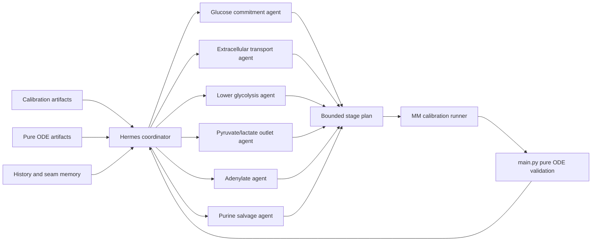

# Hermes Calibration V1

This document defines a first practical Hermes-assisted calibration loop for
the RBC metabolic model.

The goal is to let Hermes improve search quality around
[`src/MM_calibration.py`](C:/Users/Jorgelindo/Desktop/Mario_RBC_up/src/MM_calibration.py)
without turning the scientific core into a conversational system.

For the follow-on policy governing bounded source edits inside the calibration
orchestrator, see
[`AGENT_EDITABLE_CALIBRATION_POLICY.md`](C:/Users/Jorgelindo/Desktop/Mario_RBC_up/AGENT_EDITABLE_CALIBRATION_POLICY.md).

## Purpose

Hermes should help us choose better bounded calibration experiments by:

- reading calibration and pure-ODE artifacts
- diagnosing the current failure mode
- proposing a narrow next hypothesis
- writing a bounded stage plan
- launching the existing calibration runner
- comparing the result against the seed
- preserving memory about saturated seams and useful seams

Hermes should not replace:

- the RHS in [`src/equadiff_brodbar.py`](C:/Users/Jorgelindo/Desktop/Mario_RBC_up/src/equadiff_brodbar.py)
- the benchmark logic in [`src/MM_calibration.py`](C:/Users/Jorgelindo/Desktop/Mario_RBC_up/src/MM_calibration.py)
- the promotion gate enforced by the real ODE in [`src/main.py`](C:/Users/Jorgelindo/Desktop/Mario_RBC_up/src/main.py)

## Core Principle

V1 treats Hermes as an outer-loop scientific orchestrator.

The optimization hierarchy stays:

1. improve experimental curve fit
2. preserve or improve real pure-ODE behavior
3. use penalties and operational heuristics only as guardrails

Hermes helps us search more intelligently, but the solver and scoring remain
deterministic.

## Boundary Alignment

This V1 is explicitly aligned with
[`AUTOSEARCH_ARCHITECTURE.md`](C:/Users/Jorgelindo/Desktop/Mario_RBC_up/AUTOSEARCH_ARCHITECTURE.md).

### `SCIENTIFIC_FROZEN`

Hermes must not mutate:

- [`src/equadiff_brodbar.py`](C:/Users/Jorgelindo/Desktop/Mario_RBC_up/src/equadiff_brodbar.py)
- the scientific core of
  [`src/MM_calibration.py`](C:/Users/Jorgelindo/Desktop/Mario_RBC_up/src/MM_calibration.py)
- source benchmark datasets
- prior scientific artifacts

### `AUTOSEARCH_BOUNDED`

Hermes may write only bounded orchestration payloads such as:

- generated stage-plan JSON
- candidate run manifests
- Hermes decision notes
- Hermes session summaries

Suggested V1 paths:

- `config/generated/hermes_calibration/`
- `Simulations/brodbar/hermes/`

### `AUTOSEARCH_SAFE`

Hermes may invoke:

- calibration wrapper scripts
- artifact summarizers
- pure-ODE validation through [`src/main.py`](C:/Users/Jorgelindo/Desktop/Mario_RBC_up/src/main.py)
- comparison/reporting helpers

## Why Hermes Helps

The current manual loop is scientifically useful, but it is expensive in human
attention. We repeatedly need to answer questions like:

- is this seam locally saturated?
- is the current failure glucose-side, outlet-side, or adenylate-side?
- did the calibration score improve while the pure ODE got worse?
- did we really open a new basin, or just rewrite the same one?

Hermes is well-suited to:

- reading artifact history
- preserving seam memory
- comparing competing hypotheses
- composing bounded stage plans
- choosing what to try next

## V1 Agent Topology

V1 should use subsystem agents, not one LLM per enzyme.



## Agent Roles

### 1. Coordinator

Responsibilities:

- load the latest seed, reports, and pure-ODE summaries
- ask subsystem agents for bounded hypotheses
- merge or reject conflicting proposals
- choose one next stage plan
- decide whether a candidate is informative, discardable, or promotion-ready

Coordinator outputs:

- one approved stage-plan JSON
- one run request
- one decision record

### 2. Glucose Commitment Agent

Owns:

- `vmax_VHK`
- `vmax_VPFK`
- `km_GLC_HK`
- `km_G6P`
- `km_F6P`

Watches:

- `EGLC`
- `GLC`
- `G6P`
- `F6P`
- `ATP`

### 3. Extracellular Transport Agent

Owns:

- `vmax_VEGLC`
- `vmax_VELAC`
- `km_EGLC`
- `km_GLC_transport`
- `km_LAC`

Watches:

- `EGLC`
- `ELAC`
- `GLC`
- `LAC`

### 4. Lower Glycolysis Agent

Owns:

- `vmax_VPGM`
- `vmax_VENOPGM`
- `vmax_VDPGM`
- `vmax_V23DPGP`
- `vmax_VPK`

Watches:

- `P3G`
- `P2G`
- `PEP`
- `PYR`
- `B23PG`

### 5. Pyruvate/Lactate Outlet Agent

Owns:

- `vmax_VLDH`
- `km_PYR`
- `km_LAC`
- optionally tightly bounded `km_PEP`

Watches:

- `PYR`
- `LAC`
- `ELAC`
- `PEP`

### 6. Adenylate Agent

Owns:

- `vmax_VAK`
- `vmax_VAK2`
- `vmax_VAK_rev`
- `km_ADP_ATP`

Watches:

- `ATP`
- `ADP`
- `AMP`

### 7. Purine Salvage Agent

Owns:

- `vmax_VAMPD1`
- `vmax_VIMPH`
- optionally `vmax_VNDPK` and `vmax_VNDPK_rev`

Watches:

- `AMP`
- `IMP`
- `ATP`
- `ADP`

## Hermes Tool Contract

V1 should expose a narrow calibration toolset rather than one large generic
command.

Suggested tool names:

### Read tools

- `calibration_validate_agent_edit`
- `calibration_get_seed`
- `calibration_get_last_report`
- `calibration_get_candidate_history`
- `calibration_get_worst_metabolites`
- `calibration_get_trajectory_group`
- `calibration_get_pure_ode_summary`
- `calibration_get_flux_summary`
- `calibration_get_saturated_seams`

### Write / action tools

- `calibration_apply_agent_edit`
- `calibration_write_stage_plan`
- `calibration_coordinate_phase_a`
- `calibration_execute_phase_b`
- `calibration_coordinate_phase_c`
- `calibration_run_phase_d_session`

## Suggested Tool IO

### `calibration_get_worst_metabolites`

Input:

```json
{
  "report_path": "path/to/calibration_report.json",
  "limit": 12,
  "groups": ["extracellular", "energy", "glycolysis"]
}
```

Output:

```json
{
  "worst_metabolites": [
    {
      "name": "EGLC",
      "nrmse": 0.43,
      "family": "extracellular",
      "trajectory_note": "plateaus too early"
    }
  ]
}
```

### `calibration_get_pure_ode_summary`

Input:

```json
{
  "all_metabolites_csv": "Simulations/brodbar/metabolites/all_metabolites.csv",
  "groups": ["EGLC_ELAC", "ATP_ADP_AMP_IMP", "PYR_PEP_LAC"]
}
```

Output:

```json
{
  "groups": {
    "EGLC_ELAC": {
      "EGLC": {
        "start": 25.34,
        "end": 22.85,
        "shape": "too_shallow_late_plateau"
      },
      "ELAC": {
        "start": 3.61,
        "end": 17.67,
        "shape": "rising_but_underpowered"
      }
    }
  }
}
```

### `calibration_write_stage_plan`

Input:

```json
{
  "seed_params_path": "path/to/best_params.json",
  "phase": 1,
  "target_scope": "glycolysis_extracellular",
  "optimization_strategy": "vmax_then_km",
  "parameters": ["km_GLC_HK", "km_G6P", "km_F6P", "km_PYR", "km_LAC"],
  "hypothesis": "Steepen EGLC while preserving extracellular directionality",
  "protect": ["ATP", "ADP", "EGLC", "ELAC"],
  "out_path": "config/generated/hermes_calibration/stage_plan_<id>.json"
}
```

### `calibration_compare_candidates`

Input:

```json
{
  "seed_report": "path/to/seed/calibration_report.json",
  "candidate_report": "path/to/candidate/calibration_report.json",
  "seed_ode_summary": "path/to/seed/ode_summary.json",
  "candidate_ode_summary": "path/to/candidate/ode_summary.json"
}
```

Output:

```json
{
  "fit_delta": -0.18,
  "pure_ode_delta": {
    "EGLC": "better",
    "ATP": "worse",
    "ADP": "worse"
  },
  "decision_hint": "informative_but_not_promote"
}
```

## V1 State Schema

Hermes should carry one explicit calibration state object through the loop.

```json
{
  "workflow_type": "hermes_calibration_v1",
  "seed_params_path": "",
  "seed_report_path": "",
  "seed_main_ode_csv_path": "",
  "active_hypothesis": "",
  "target_scope": "",
  "optimization_strategy": "",
  "priority_groups": ["extracellular", "energy", "glycolysis"],
  "protected_metabolites": ["ATP", "ADP", "EGLC", "ELAC", "B23PG"],
  "known_saturated_seams": [],
  "candidate_stage_plan_path": "",
  "candidate_run_dir": "",
  "candidate_report_path": "",
  "candidate_main_ode_csv_path": "",
  "decision": "",
  "decision_reason": "",
  "promotion_status": "seed|informative|promote|discard"
}
```

## Agent Output Schema

Each subsystem agent should return a structured proposal, not free-form prose.

```json
{
  "agent": "glucose_commitment",
  "hypothesis": "Upstream glucose commitment is limiting EGLC depletion",
  "target_metabolites": ["EGLC", "GLC", "G6P", "F6P"],
  "allowed_parameters": ["vmax_VHK", "vmax_VPFK", "km_GLC_HK", "km_G6P", "km_F6P"],
  "expected_gain": ["steeper_EGLC", "better_GLC_shape"],
  "risk_metabolites": ["ATP", "ELAC"],
  "recommendation_strength": 0.71,
  "should_run": true
}
```

## Decision Hierarchy

V1 should rank candidates in this order:

1. experimental fit improvement on the intended target family
2. pure-ODE sanity improvement or at least non-regression
3. penalties only as guardrails
4. runtime and convenience last

Promotion rules:

- `promote`
  - better calibration fit
  - no new pure-ODE collapse
  - protected metabolites preserved or improved
- `informative`
  - opened a new basin or clarified a tradeoff
  - not safe to promote as the new default seed
- `discard`
  - fit did not improve
  - pure ODE regressed materially
  - or the candidate only reproduced an already saturated seam

## V1 Control Loop

```text
1. Load current seed
2. Load last calibration report
3. Run or read pure ODE summary for the seed
4. Load seam history and saturated seams
5. Ask subsystem agents for bounded hypotheses
6. Coordinator selects exactly one next stage plan
7. Write stage-plan JSON
8. Run MM_calibration.py with the stage plan
9. Run main.py on the candidate
10. Compare seed vs candidate on:
    - target family fit
    - protected metabolites
    - pure ODE behavior
11. Record decision as promote / informative / discard
12. Update seam memory
```

## Example V1 Loop For The Current Problem

Current scientific problem:

- `EGLC` improved but is still too shallow in the pure ODE
- `ATP` and `ADP` still collapse in the long horizon
- `PYR/LAC` remain distorted
- several local glucose/downstream seams are already saturated

In this situation Hermes should:

1. read the current best seed report and pure-ODE summary
2. recognize that the nearby glucose basin is saturated
3. ask:
   - extracellular transport agent
   - adenylate agent
   - purine salvage agent
   - pyruvate/lactate outlet agent
4. reject duplicate seam proposals already marked saturated
5. choose one new hypothesis, for example:
   - adenylate-coupling rescue
   - or PPP/redox support if energy collapse appears redox-linked
6. run one bounded stage plan only
7. require the pure ODE to stay non-regressive on `EGLC`

## Memory Model

Hermes should preserve lightweight seam memory after each run.

Suggested record schema:

```json
{
  "timestamp": "ISO-8601",
  "seed_id": "phase2_adenylate_probe_from_glucose_shape",
  "hypothesis_family": "adenylate",
  "parameter_seam": ["vmax_VAK", "vmax_VAK2", "vmax_VAK_rev", "km_ADP_ATP"],
  "result": "informative",
  "fit_summary": {
    "ATP": "slightly_better",
    "ADP": "still_collapsed",
    "EGLC": "preserved"
  },
  "pure_ode_summary": {
    "ATP": "collapse",
    "ADP": "collapse",
    "PYR": "distorted"
  },
  "seam_status": "saturated|open|dangerous"
}
```

This memory should let Hermes avoid repeating:

- saturated seams
- dangerous compensator seams
- fit-improving but pure-ODE-worsening basins

## Minimal Implementation Plan

### Phase A

Read-only Hermes critic.

- Hermes reads artifacts
- Hermes proposes next stage plan
- human runs it manually
- Implemented pieces:
  - shared calibration state schema in `services/robocop/calibration_state.py`
  - coordinator prompt contract in `services/robocop/calibration_prompts.py`
  - read-only calibration tools plus `calibration_write_stage_plan` and `calibration_coordinate_phase_a`
  - bounded stage-plan output under `config/generated/hermes_calibration/`

### Phase B

Bounded Hermes executor.

- Hermes writes stage-plan JSON
- Hermes launches the calibration runner
- Hermes launches the pure-ODE check
- Hermes records decision notes
- Implemented pieces:
  - `services/robocop/calibration_phase_b.py`
  - `calibration_execute_phase_b`
  - Phase B decision record written under the generated Phase B run directory
  - seed-vs-candidate comparison across calibration fit and pure-ODE summaries
  - bounded classification into `promote`, `informative`, or `discard`

### Phase C

Subsystem-agent arbitration.

- coordinator queries subsystem agents
- one merged bounded plan is approved
- Implemented pieces:
  - `services/robocop/calibration_phase_c.py`
  - `calibration_coordinate_phase_c`
  - compatibility-aware coalition selection for subsystem proposals
  - bounded multi-stage stage-plan drafting from compatible seams
  - optional handoff into Phase B for seed-vs-candidate execution and classification

### Phase D

Session memory and repeated bounded cycles.

- Hermes uses seam memory across several calibration cycles
- still no direct edits to scientific source files
- Implemented pieces:
  - `services/robocop/calibration_phase_d.py`
  - `calibration_run_phase_d_session`
  - seed-aware seam-memory reuse across repeated bounded cycles
  - same-seed saturated seams are fed back into the next arbitration pass
  - dangerous seams can carry forward across promoted seeds
  - seed advancement happens only after a Phase B `promote`
- session summaries and seam-memory ledgers are written under `Simulations/brodbar/hermes/phase_d/`

### Phase E

Guarded source-patch loop for bounded calibration edits.

- Hermes proposes `afterText` for an allowed calibration file
- the write path must pass `calibration_apply_agent_edit`
- `py_compile` runs before any scientific validation
- Phase B runs only after the patch survives the edit gate
- the patch is kept only for accepted decisions and otherwise reverted automatically
- Implemented pieces:
  - `services/robocop/calibration_phase_e.py`
  - `calibration_execute_patch_proposal`
  - guarded keep/revert behavior after scientific validation

## V1 Deliverable Definition

V1 is complete when we have:

- a Hermes calibration tool contract
- a structured state schema
- subsystem-agent roles
- a bounded stage-plan format
- one execution loop that calls:
  - [`src/MM_calibration.py`](C:/Users/Jorgelindo/Desktop/Mario_RBC_up/src/MM_calibration.py)
  - [`src/main.py`](C:/Users/Jorgelindo/Desktop/Mario_RBC_up/src/main.py)
- a decision record that distinguishes:
  - promote
  - informative
  - discard
- one guarded patch loop that can:
  - validate a bounded source edit
  - apply it
  - run scientific validation
  - keep or revert it based on the decision policy
- manual promotion review still sits above the scientific core, even after Phase B

## Agent-Editable Enforcement Layer

The first source-edit enforcement layer is now in place for the calibration
orchestrator policy.

Current scope:

- full-file autonomy on
  [`src/MM_calibration.py`](C:/Users/Jorgelindo/Desktop/Mario_RBC_up/src/MM_calibration.py)
- explicit rejection of edits to
  [`src/equadiff_brodbar.py`](C:/Users/Jorgelindo/Desktop/Mario_RBC_up/src/equadiff_brodbar.py)
- Hermes-side validation through `calibration_validate_agent_edit`
- guarded write-path enforcement through `calibration_apply_agent_edit`

This opens the full calibration orchestrator while keeping the ODE core frozen.

V1 is not:

- a live LLM inside the ODE
- autonomous mutation of the scientific core
- one agent per enzyme at runtime

## Recommendation

The first implementation should be conservative:

- one coordinator
- five to seven subsystem agents
- a tiny calibration-specific Hermes toolset
- bounded stage-plan generation only
- mandatory pure-ODE revalidation after each candidate

That gives us the upside of Hermes reasoning without sacrificing the scientific
discipline already built into the repo.
